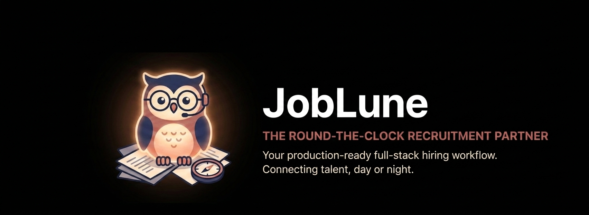

<div align="center">

# 🌙 JobLune

### Modern Full-Stack Recruitment Platform

### Connecting Employers and Job Seekers Through a Secure Hiring Workflow

<br>

<p align="center">
  
</p>

<br>


<br><br>

> **A production-inspired recruitment platform where employers can publish jobs, manage applicants, and job seekers can discover opportunities and apply with resume uploads through a secure end-to-end hiring workflow.**

</div>

---

# 📖 Table of Contents

- Overview
- Problem Statement
- Solution
- Key Features
- System Architecture
- Engineering Decisions
- Technology Stack
- Data Model
- Project Structure
- Screenshots
- API Overview
- Security
- Local Development
- Deployment
- CI/CD
- Environment Variables
- Future Roadmap
- Known Limitations
- AI Usage
- License

---

# 🌟 Overview

JobLune is a full-stack recruitment platform designed around a complete hiring workflow rather than isolated CRUD operations.

The application allows:

- Employers to publish and manage job listings
- Job seekers to browse openings using search and filters
- Resume uploads through Cloudinary
- Secure authentication using JWT
- Application tracking throughout the recruitment lifecycle

Instead of attempting to replicate every feature of large commercial job portals, JobLune focuses on implementing a clean, reliable, and maintainable hiring pipeline.

---

# 🎯 Problem Statement

Many portfolio job board projects stop after implementing basic job posting pages.

Real recruitment systems involve considerably more than simply storing job records.

They require:

- User authentication
- Role-based authorization
- Employer-owned resources
- Resume management
- Application lifecycle tracking
- Secure file storage
- Database integrity constraints
- Deployment across multiple services

JobLune was built to demonstrate these practical engineering concerns while keeping the system approachable and maintainable.

---

# 💡 Solution

JobLune implements a complete hiring workflow consisting of three user roles:

### 👨‍💼 Employer

- Register company account
- Publish job openings
- Edit and archive jobs
- Review applicants
- Update hiring status

### 👩‍💻 Job Seeker

- Register account
- Search available jobs
- Filter by keyword and location
- Upload resumes
- Apply to positions
- Track submitted applications

### 🛡 Administrator

- Administrative permissions
- Resource moderation
- Access protected management endpoints

---

# ✨ Core Features

## 🔐 Authentication

- JWT access tokens
- Refresh token support
- BCrypt password hashing
- Stateless Spring Security
- Role-based authorization

---

## 💼 Job Management

Employers can:

- Create jobs
- Edit postings
- Archive jobs
- Delete jobs
- View employer-only listings

Search supports:

- Keyword matching
- Location filtering
- Employment type
- Tags
- Active status filtering

---

## 📄 Resume Uploads

Applicants upload resumes directly to Cloudinary.

Benefits include:

- Reduced backend storage
- Secure file hosting
- Faster delivery
- Public URL generation

---

## 📋 Application Management

Each application belongs to:

- one applicant
- one job

The database enforces a unique constraint preventing duplicate applications.

Application lifecycle:

```text
APPLIED
     │
     ▼
REVIEWED
     │
     ▼
SHORTLISTED
     │
 ┌───┴────┐
 ▼        ▼
HIRED  REJECTED
```

---

## 🔍 Search Experience

Visitors can browse jobs without authentication.

Filtering supports:

- keywords
- location
- employment type
- tags

Employers additionally receive a private dashboard showing all of their own postings, including inactive jobs.

---

# 🏗 System Architecture

```text
                        React Frontend (Vite)
                               │
                     HTTPS / JSON Requests
                               │
                               ▼
                   Spring Boot REST Application
                               │
      ┌───────────────┬───────────────┬──────────────┐
      ▼               ▼               ▼
 PostgreSQL      Cloudinary      Spring Security
  Persistence    Resume Storage   JWT Validation
```

---

# ⚙ Engineering Decisions

## Why Spring Boot?

Spring Boot provides:

- mature security framework
- validation support
- dependency injection
- JPA integration
- production-ready REST development

making it well suited for authentication-heavy business applications.

---

## Why PostgreSQL?

The project relies on relational consistency.

PostgreSQL enables:

- foreign key enforcement
- unique constraints
- transactional integrity
- indexing
- Flyway migrations

which fit naturally with recruitment workflows.

---

## Why Cloudinary?

Storing uploaded resumes directly on the application server increases operational complexity.

Cloudinary provides:

- managed file hosting
- CDN delivery
- secure uploads
- reduced server storage requirements

allowing the backend to focus on business logic rather than file management.

---

## Why Separate Frontend and Backend Deployments?

The frontend is deployed independently from the backend.

```text
Frontend
React + Vite
        │
     Vercel

Backend
Spring Boot
        │
     Render
```

This architecture reflects how many production applications separate static frontend hosting from long-running backend services.

Spring Boot requires a persistent JVM process, making Render an appropriate deployment target, while Vercel efficiently serves the React application.

---

# 🧩 Technology Stack

| Layer | Technology |
|------------|------------------------------|
| Backend | Java 21 |
| Framework | Spring Boot 3.3 |
| Frontend | React 18 + Vite |
| Styling | Tailwind CSS |
| Authentication | Spring Security + JWT |
| Database | PostgreSQL |
| ORM | Spring Data JPA |
| Schema Migration | Flyway |
| File Storage | Cloudinary |
| API Documentation | Swagger / OpenAPI |
| Testing | JUnit 5, Mockito, MockMvc |
| CI/CD | GitHub Actions |
| Deployment | Render + Vercel |
| Containerization | Docker |

---

---

# ✨ Core Features

## 🔐 Authentication & Authorization

Modern hiring platforms require more than simple login forms. JobLune implements a secure authentication pipeline centered around stateless JWT authentication.

### Features

- JWT Access & Refresh Token authentication
- BCrypt password hashing
- Stateless Spring Security configuration
- Role-based authorization
- Refresh token rotation
- Protected API endpoints
- Custom authentication filters
- Global exception handling

Supported Roles

| Role | Capabilities |
|------|--------------|
| Job Seeker | Search jobs, upload resumes, apply, track applications |
| Employer | Manage company profile, publish jobs, review applicants |
| Admin | Administrative moderation and management capabilities |

---

# 💼 Employer Workspace

Employers can manage the complete recruitment lifecycle from a single dashboard.

### Features

- Company profile management
- Publish job postings
- Edit existing jobs
- Archive inactive jobs
- Review applicants
- Change hiring status
- Resume viewing
- Ownership-based authorization

Application Workflow

```text
Draft Job
      │
      ▼
Published
      │
      ▼
Applications Received
      │
      ▼
Review
      │
      ▼
Shortlisted
      │
      ├────────► Rejected
      │
      ▼
Hired
```

---

# 👨‍💻 Job Seeker Experience

Job seekers have access to a streamlined application workflow focused on simplicity.

Capabilities include:

- Account registration
- Secure authentication
- Advanced job search
- Resume upload
- One-click applications
- Application tracking
- Status monitoring

Duplicate applications are prevented through database-level constraints.

---

# 🔍 Search & Discovery

The search engine supports filtering across multiple dimensions.

Available filters

- Keyword
- Job Type
- Location
- Tags
- Employer
- Active Status

Backend implementation leverages Spring Data JPA Specifications and pageable queries.

---

# 📂 Resume Management

Uploaded resumes are stored securely using Cloudinary.

Pipeline

```text
Browser
     │
     ▼
Multipart Upload
     │
     ▼
Spring Boot Validation
     │
     ▼
Cloudinary Storage
     │
     ▼
Secure URL
     │
     ▼
Application Record
```

Advantages

- No filesystem dependency
- CDN delivery
- Secure storage
- Lightweight backend

---

# 🗄️ Database Design

Core Entities

```text
User
 │
 ├──────── Employer
 │              │
 │              ▼
 │          Company
 │              │
 │              ▼
 │             Job
 │              │
 ▼              ▼
Application ◄────┘
```

Relationships

User

- One user may own multiple applications
- Employer users own one company

Company

- One company can publish many jobs

Job

- One job receives many applications

Application

- Belongs to one job
- Belongs to one applicant

Database Constraints

✔ Unique applicant/job pair

✔ Foreign key integrity

✔ Referential consistency

✔ Flyway-managed schema evolution

---

# 🔒 Security Engineering

JobLune follows secure backend development practices.

Implemented protections include

### Authentication

- JWT access tokens
- Refresh tokens
- BCrypt hashing

### Authorization

- Spring Security
- Role-based access control
- Ownership validation

### Validation

- Bean Validation
- DTO validation
- Input sanitization

### Database

- Parameterized JPA queries
- Flyway migrations
- Referential integrity

### API

- Exception handling
- Proper HTTP status codes
- Consistent response models

---

# ⚡ Performance Considerations

Although JobLune is intentionally scoped as an MVP, several engineering decisions improve scalability.

Implemented

- Stateless authentication
- Pageable database queries
- Indexed foreign keys
- Lazy entity loading
- Cloud-hosted file storage
- Docker deployment

Future improvements

- Redis caching
- Elasticsearch
- RabbitMQ
- CDN optimization
- Rate limiting
---

# 📂 Project Structure

```text
joblune/
│
├── backend/
│   ├── src/
│   │   ├── config/
│   │   ├── controller/
│   │   ├── dto/
│   │   ├── entity/
│   │   ├── exception/
│   │   ├── repository/
│   │   ├── security/
│   │   ├── service/
│   │   ├── validation/
│   │   └── JobLuneApplication.java
│   │
│   └── resources/
│       ├── db/
│       │   └── migration/
│       └── application.yml
│
├── frontend/
│   ├── src/
│   │   ├── api/
│   │   ├── components/
│   │   ├── hooks/
│   │   ├── layouts/
│   │   ├── pages/
│   │   ├── routes/
│   │   └── styles/
│   │
│   └── vite.config.js
│
├── docker-compose.yml
├── README.md
└── .github/
    └── workflows/
```

---

# 📡 REST API Overview

## Authentication

```http
POST /api/auth/register
POST /api/auth/login
POST /api/auth/refresh
```

---

## Jobs

```http
GET    /api/jobs
GET    /api/jobs/{id}
GET    /api/jobs/mine

POST   /api/jobs
PUT    /api/jobs/{id}
DELETE /api/jobs/{id}
```

---

## Applications

```http
POST  /api/applications
GET   /api/applications/me
GET   /api/applications/job/{id}

PATCH /api/applications/{id}/status
```

---

## Uploads

```http
POST /api/uploads/resume
```

Swagger UI documents every endpoint with request/response schemas.

---

# 🚀 Local Development

## Prerequisites

- Java 21
- Maven
- PostgreSQL
- Node.js 20+
- Docker (optional)

---

## Backend

```bash
cd backend

./mvnw spring-boot:run
```

Runs at

```
http://localhost:8080
```

Swagger

```
http://localhost:8080/swagger-ui.html
```

---

## Frontend

```bash
cd frontend

npm install

npm run dev
```

Runs at

```
http://localhost:5173
```

---

## Docker

```bash
docker compose up --build
```

Starts

- PostgreSQL
- Spring Boot backend

---

# 🌐 Deployment

## Backend

Hosted on

Render

Deployment includes

- Docker container
- Managed PostgreSQL
- Environment variables
- HTTPS

---

## Frontend

Hosted on

Vercel

Features

- Global CDN
- Automatic deployments
- Git integration

---

## CI/CD

GitHub Actions automate

✔ Build

✔ Test

✔ Deploy

Deployment only occurs after successful builds.

---

# 📊 Engineering Trade-offs

Every production project involves balancing complexity against maintainability.

Current design intentionally avoids

- Microservices
- Kafka
- Elasticsearch
- Distributed transactions
- Kubernetes

These technologies would introduce significant operational complexity without adding proportional value for an MVP-scale recruitment platform.

Instead, JobLune focuses on

- Clear architecture
- Secure authentication
- Reliable CRUD workflows
- Maintainable codebase
- Production deployment
---

# 🔮 Future Roadmap

The architecture has been intentionally designed to accommodate future expansion.

## Search

- Elasticsearch integration
- Semantic search
- AI-assisted recommendations

---

## Employer Features

- Team workspaces
- Interview scheduling
- Candidate notes
- Hiring analytics

---

## Job Seeker Features

- Resume parsing
- AI resume feedback
- Skill gap analysis
- Career recommendations

---

## Platform

- Email notifications
- WebSocket notifications
- Redis caching
- Background jobs
- API rate limiting
- OpenTelemetry monitoring

---

# 🤖 AI Usage Disclosure

AI tools were used responsibly throughout development.

AI assisted with

- Initial project scaffolding
- Boilerplate generation
- Documentation drafting
- UI refinement ideas

Every generated component was manually reviewed, integrated, tested, and modified where necessary.

Architecture, feature integration, debugging, deployment, schema design, authentication flow, and overall engineering decisions were implemented and validated by the project author.

---

# 📚 Lessons Learned

Developing JobLune reinforced several important engineering principles.

Key takeaways include

- Designing secure authentication flows
- Building maintainable REST APIs
- Applying layered backend architecture
- Managing relational data with JPA
- Structuring frontend routing and state
- Integrating cloud storage services
- Configuring CI/CD pipelines
- Deploying production-ready applications

---

# ⚠️ Known Limitations

Current scope intentionally excludes

- Email notifications
- Real-time messaging
- AI-powered candidate matching
- Employer analytics dashboards
- Advanced recommendation engines
- Multi-language localization

These features remain natural extensions for future versions.

---

# 🛠️ Tech Stack

| Layer | Technology |
|---------|------------|
| Language | Java 21 |
| Backend | Spring Boot 3 |
| Security | Spring Security, JWT |
| Database | PostgreSQL |
| ORM | Spring Data JPA |
| Schema Migration | Flyway |
| File Storage | Cloudinary |
| Frontend | React 18 |
| Styling | Tailwind CSS |
| Routing | React Router |
| Documentation | Swagger/OpenAPI |
| Testing | JUnit 5, Mockito |
| Build | Maven, Vite |
| CI/CD | GitHub Actions |
| Deployment | Render, Vercel |

---

# 📈 Project Highlights

✔ Production-style layered architecture

✔ JWT authentication with refresh tokens

✔ Role-based authorization

✔ Flyway schema migrations

✔ Cloudinary resume storage

✔ Responsive React frontend

✔ RESTful API design

✔ Docker-ready deployment

✔ GitHub Actions CI/CD

✔ Swagger API documentation

✔ Comprehensive validation and exception handling

✔ Maintainable, modular codebase

---

# 👨‍💻 Developer

**Ashish Patel**

Computer Science Engineering Student

Passionate about

- Backend Engineering
- Distributed Systems
- AI-powered Applications
- Full-Stack Development
- Cloud-native Architecture

GitHub

```
https://github.com/ashhuxt/joblune.git
```
Live Demo 
```
https://joblune.vercel.app
```
---

<div align="center">

# 🌙 JobLune

### Hiring Never Sleeps.

*A production-ready full-stack job platform demonstrating secure authentication, modern backend engineering, scalable architecture, and polished user experience.*

⭐ If you found this project interesting, consider giving it a star.

</div>
